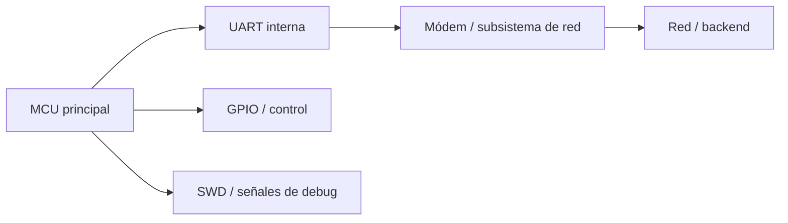

+++
title = "Demo de Arquetipo: Artículo de Investigación en Seguridad"
date = 2026-04-15
draft = true
description = "Artículo de ejemplo para validar el arquetipo de research: jerarquía, ritmo, visuales y estructura."
summary = "Una demo realista para comprobar cómo se lee y se navega un artículo largo de investigación técnica en Quihacker's Lab."
tags = ['cybersecurity', 'hardware-hacking', 'research']
ShowToc = true
cover = { image = '/images/landing.png', alt = 'Demo visual del arquetipo de research', caption = 'Portada temporal para validar composición y jerarquía', relative = false, hidden = false, hiddenInList = false, hiddenInSingle = false }
images = ['/images/landing.png']
+++

## El hallazgo en una frase

Analicé un dispositivo IoT aparentemente anodino y descubrí que la superficie útil no estaba en una consola de debug “evidente”, sino en la combinación de una interfaz UART funcional, un canal de telemetría comprensible y una protección parcial por hardware que dejaba justo suficiente margen para un análisis serio.

## Por qué importa

- Demuestra cómo convertir observaciones dispersas en un modelo técnico sólido.
- Sirve para validar el formato de artículos largos con evidencia, no solo opinión.
- Muestra el tipo de estructura que mejor encaja cuando el valor está en el método, no solo en el “pwn”.

## TL;DR

- El target parecía cerrado, pero dejaba varios artefactos observables.
- La clave no fue una prueba agresiva, sino una buena reducción del espacio de búsqueda.
- El artículo gira alrededor de una idea: ver antes de tocar.
- El formato prioriza escaneabilidad, pruebas visibles y una lección reusable.
- Esta demo está pensada para evaluar forma, no contenido final.

## Qué tenía delante

Imagina una PCB sin esquemas, con varios pads expuestos, un microcontrolador, un módem y un comportamiento poco documentado. El tipo de objetivo que invita a tocar demasiado pronto y pensar demasiado tarde. El objetivo del artículo no sería romantizar el desmontaje, sino explicar cómo pasar de “hay muchos pines” a “estos dos importan y por esto”.

### Arquitectura simplificada



## Hipótesis iniciales

- La primera hipótesis era que existiría una UART útil, pero no necesariamente una consola de debug clásica.
- La segunda era que los pads expuestos podían incluir SWD, aunque no habría actividad espontánea que lo delatase.
- La tercera era que el tráfico más interesante no estaría en el “boot banner”, sino en lo que el sistema enviaba al exterior.

## La observación que cambió el juego

La observación decisiva no fue una shell, ni un crash, ni un banner glorioso. Fue mucho más humilde: un subconjunto de pines tenía un comportamiento eléctrico coherente con líneas que “hablan” y otras que “escuchan”. Ese pequeño cambio de marco redujo drásticamente el ruido del laboratorio y convirtió una placa opaca en un sistema con candidatos razonables.

## Cómo lo validé

### 1. Preparación

Primero se fijó una referencia de masa fiable, se clasificaron pines por resistencia a GND y se descartó todo lo que eléctricamente no podía transportar información útil.

### 2. Experimento

Después se observaron solo los candidatos plausibles durante el arranque y en operación normal, sin inyectar señales ni forzar estados prematuramente.

### 3. Resultado

El sistema acabó revelando dos cosas:

- un canal de comunicación interno con semántica reconocible
- una superficie de control/debug útil pero limitada por protecciones de hardware

### 4. Qué queda razonablemente descartado

- Que todos los pads expuestos sean relevantes
- Que la ausencia de actividad espontánea implique ausencia de debug
- Que una única captura larga sea suficiente para explicar el comportamiento del sistema

## Evidencia clave

### Tabla de evidencias

| Evidencia | Qué demuestra | Nivel de confianza |
| --- | --- | --- |
| Medición pasiva de pines | Reduce candidatos sin tocar el sistema | Alto |
| Tráfico UART coherente | Existe una conversación funcional | Alto |
| `reset halt` fiable | Hay control temprano del core | Alto |
| Lectura fallida de flash | Existe una protección efectiva | Alto |
| Hipótesis sobre payload | Requiere más correlación | Medio |

### Fragmento representativo

```text
AT+NSOCR=DGRAM,17,0,1
AT+NSOSTF=0,10.6.32.20,4445,0x400,77,<HEX>
OK
```

Ese tipo de fragmento es ideal porque enseña tres cosas a la vez: protocolo, intención y contexto operativo.

## Qué demuestra realmente

### Confirmado

- Existe una interfaz interna útil para análisis funcional.
- El sistema se apoya en un canal serie estructurado, no en ruido accidental.
- La protección de memoria no equivale a opacidad total del dispositivo.

### Inferido con bastante confianza

- Parte del payload contiene identidad, red o estado del dispositivo.
- El comportamiento del módem refleja decisiones del firmware, no solo defaults del vendor.

### Aún no demostrado

- El significado completo del payload
- La posibilidad de extracción íntegra de firmware
- El impacto explotable más allá del laboratorio controlado

## El patrón general

El patrón reusable no es “encuentra una UART”, sino algo más útil: en sistemas embebidos conectados, el valor suele aparecer cuando combinas tres capas distintas de observación:

1. comportamiento eléctrico
2. comportamiento lógico
3. comportamiento funcional

Cuando esas tres capas encajan, el target deja de ser una caja negra y pasa a ser un sistema razonable, aunque siga protegido.

## Implicaciones defensivas

- Los test pads no son inocentes solo porque no tengan serigrafía amable.
- La telemetría puede filtrar mucho más contexto del que el equipo espera.
- Bloquear lectura de flash no elimina el valor ofensivo ni forense de la RAM, los buses o el timing de arranque.

## Disclosure y límites éticos

- Esta demo no documenta un target real concreto.
- El enfoque prioriza observación, reducción de incertidumbre y validación gradual.
- Se evita describir pasos cuyo valor principal sería operacional y no educativo.

## Conclusión

Un buen artículo de seguridad no vive solo del impacto; vive de su capacidad para enseñar a pensar. Si el lector termina el texto entendiendo no solo qué encontraste, sino por qué supiste dónde mirar, el artículo ya está haciendo trabajo serio.

Y si además se lee con gusto, mejor todavía: bastante árida es ya la electrónica como para escribirla como si fuera una multa.

## Apéndice

### Setup

- Analizador lógico
- Multímetro
- Referencia de masa estable
- Capturas anotadas
- Paciencia, que sigue siendo una herramienta infravalorada

### Referencias

- Nielsen Norman Group
- WCAG 2.1
- Project Zero
- PortSwigger Research
